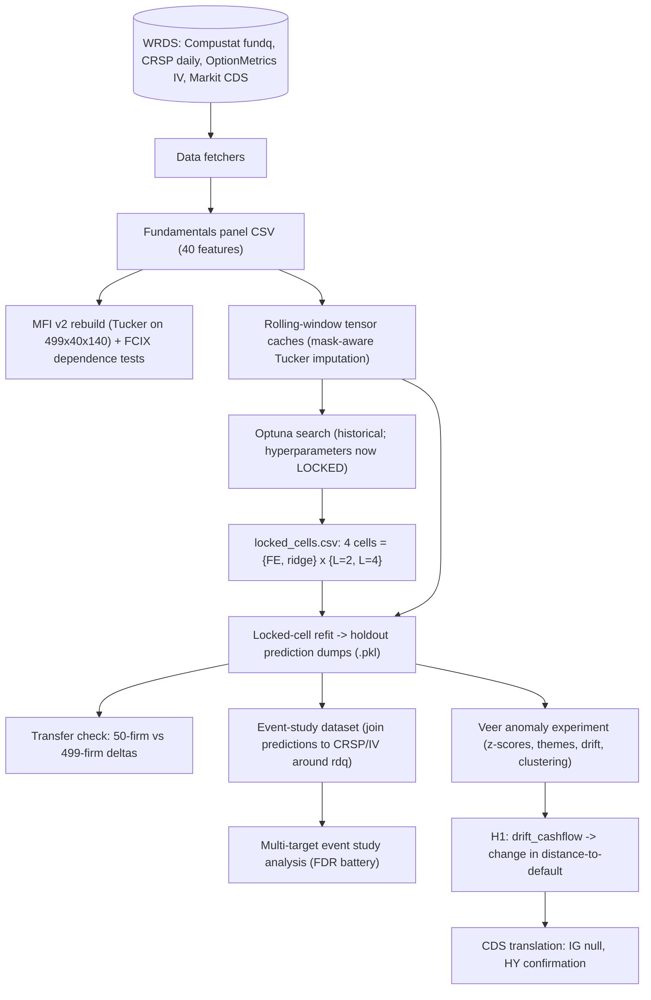

# Study Guide: Tensor Research Project

Purpose: a self-contained map for internalizing this project — what each paper
section claims, which code produced it, what the key functions do, and where the
numbers live. Written to be pasted (section by section, alongside one code file
at a time) into external LLM sessions (e.g. ChatGPT) that have no access to this
machine.

Two codebases exist:

- `Code for paper/` — the historical record. Everything that was ever run,
  including legacy versions, distributed-compute infrastructure, and process
  scars. Do not modify.
- `replication/` — the clean, infrastructure-free port of the canonical
  pipeline. **Study this one.** Each module below lists both paths.

The decision history (why choices were made, audit findings, pre-registrations)
is in `RESEARCH_LOG.md`. Numbers in the paper should be verified against the
result files listed here, never against an LLM's recollection.

---

## 1. One-paragraph summary of the project

Quarterly accounting fundamentals for U.S. firms are arranged as a third-order
tensor (firms x features x quarters). Part 1 (Masoud's, pre-prediction): a
Tucker-decomposition-based Market Fundamentals Index (MFI) built from the
time-mode factors, shown to be statistically dependent on a price-based
Financial Chaos Index (FCIX). Part 2 (ours, prediction onward): missing entries
are imputed window-by-window with mask-aware Tucker; a low-rank CP tensor
regression is deployed as a *booster* over two baselines (firm-feature fixed
effects, per-feature ridge) to forecast the entire next-quarter panel; the gain
is positive in all four locked configurations on a calendar-fixed holdout and
survives a frozen-hyperparameter transfer from 50 to 499 firms. Part 3
(economic content): announcement event studies show mega-cap equity/IV markets
already price the information, but forecast-error ("veer") signals predict
credit-quality changes (distance-to-default, all universes) and actually
tradeable CDS spread changes in the high-yield/crossover universe (~6.5 bp per
1 sigma), while investment-grade CDS show a clean null.

## 2. Pipeline at a glance

## 3. Paper section -> code -> outputs

Paper file: `Paper_Draft/main_v2.tex` (v2 = current; `main.tex` is the older
draft, kept frozen). Sections before "Predictive Modeling" are Masoud's; only
their exhibits were updated (v2 data).

### 3.1 Encoding Fundamentals / MFI / FCIX dependence (secs. 2-3, Masoud block)

| What | Where |
|---|---|
| Feature spec (the 40 features, Compustat source columns, YTD-to-quarterly transforms) | `Code for paper/pre_prediction_config.py` -> `replication/config.py` |
| MFI v2 rebuild: 499x40x140 tensor, Tucker [67,40,20], MFI from time-mode factors, FCIX merge, permutation independence tests | `Code for paper/rebuild_mfi_tensor_v2.py` -> `replication/src/mfi/build_mfi.py` |
| Figures (Fig_QMFI_v2, Fig_Cross_Corr_Quarters_v2) | `Code for paper/regen_prepred_figures_v2.py` -> `replication/src/mfi/figures.py` |
| Outputs | `Code for paper/pre_prediction_cache/mfi_v2/` (mfi_quarterly_v2.csv, mfi_fcix_quarterly_v2.csv, independence_permutation_v2.csv, mfi_v2_summary.json) |

Key facts: observed-entry density 74.0%; MFI-FCIX cross-correlation peak 0.32;
independence rejected at 1% (L_n = 0.546 vs crit 0.459; I_n = 0.237 vs 0.174).

### 3.2 Tensor construction and imputation (sec. 4.1)

| What | Where |
|---|---|
| Panel -> raw tensor -> rolling-window mask-aware Tucker imputation -> cache | `Code for paper/prediction_new/build_prediction_caches.py` -> `replication/src/tensors/build_caches.py` |
| Key functions | `load_filtered_panel` (universe + grid snap), `build_raw_tensor`, `process_window` (per-window Tucker fill; observed cells preserved exactly) |
| Imputation rank selection (one-SE rule) | `Code for paper/prediction_new/sweep_imputer_ranks_cv.py`; summary in `prediction_new/sweep_results/imputer_rank_cv_stratified_summary.csv` |
| Outputs | `tensor_cache*/tensor_{levels,surprise}_L{2,4}.pkl` + `meta.pkl` |

Key facts: development panel 50x40x80, density ~90.3%; ranks [2,2,2] for L=2,
[4,4,4] for L=4 (time-mode rank fixed at L); LEVELS mode is the paper's focus.

### 3.3 CP regression as booster + evaluation protocol (secs. 4.2-4.3)

| What | Where |
|---|---|
| Objectives, baselines, OOF discipline, holdout evaluation | `Code for paper/prediction_new/worker.py` (`make_objective`, `_compute_ridge_predictions_for_fold`, `firm_feature_means`, `evaluate_model`) -> `replication/src/model/refit_and_dump.py` |
| Memory-lean CP fitter (Gram identity, avoids Khatri-Rao blowup) | `Code for paper/prediction_new/cp_regressor_lowmem.py` (`LowMemCPRegressor`, `_kr`) -> `replication/src/tensors/cp_lowmem.py` |
| Locked-cell refit and prediction dumps | `Code for paper/prediction_new/dump_test_predictions.py` -> same replication module |
| Locked hyperparameters (4 cells) | `Code for paper/prediction_new/results/v3_holdout_ext_20260629_230144/aggregate_summary.csv` -> `replication/locked_cells.csv` |

The four locked cells (mode LEVELS, rank_order 1, from that aggregate_summary):

| objective | L | CP rank | REG_W | GAMMA | base R2 | ens. R2 | delta |
|---|---|---|---|---|---|---|---|
| ridge_delta_v3 | 2 | 4 | 23.343 | 0.751 | 0.7637 | 0.7830 | +0.0193 |
| ridge_delta_v3 | 4 | 5 | 30.195 | 0.843 | 0.7665 | 0.7773 | +0.0108 |
| residual_delta_v3 | 2 | 13 | 27.191 | 1.263 | 0.7206 | 0.7682 | +0.0476 |
| residual_delta_v3 | 4 | 12 | 24.028 | 1.352 | 0.7219 | 0.7650 | +0.0432 |

Prediction: `Y_hat = B_t + gamma * s * <X_t, W>`, where B_t is the baseline
(fixed effects or per-feature ridge), W the CP weight tensor (5 factor
matrices over modes N, F, L | N, F), s the target-scaling inverse.
Calendar-fixed split: test targets start 2021Q1 (`PRED_TEST_START_Q`).

### 3.4 Transfer to 499 firms (sec. 5)

| What | Where |
|---|---|
| Transfer gate script | `Code for paper/prediction_new/transfer_check_499.py` -> `replication/src/model/transfer_check.py` |
| Outputs | `prediction_new/results/v3_holdout_499_20260706/transfer_check_499.csv` + `transfer_check_verdict.txt` |

Key fact: delta positive in 4/4 cells at frozen hyperparameters; ridge-cell
deltas essentially unchanged, FE-cell deltas ~40% of mega-cap size.

### 3.5 Event studies (sec. 6.1)

| What | Where |
|---|---|
| Dataset build (join dumps to CRSP/FF3/IV around rdq; window targets incl. CAR, vol, straddle proxy) | `Code for paper/prediction_new/build_event_study_dataset.py` (`compute_event_targets`, `_ff3_betas`, `_vol_source_straddle`) -> `replication/src/analysis/event_study_dataset.py` |
| Multi-target analysis (Fama-MacBeth, rank-IC, partial IC, FDR: BH/BY/Holm, block bootstrap, L/S portfolios) | `Code for paper/prediction_new/analyze_event_study_multi.py` (`analyze_pair`, `_fm_slope`, `_partial_rank_ic`, `_incr_control_battery`, `_ls_portfolio`) -> `replication/src/analysis/event_study_multi.py` |
| Outputs | per holdout dir: `event_study_multitarget_*.csv`, `*_multitarget_summary.csv`, `multitarget_report_*.txt` |

Key facts: equity-return effects null after FDR at mega-caps; forecasts
subsumed by implied volatility (IV) for mega-caps; no straddle alpha at
mega-caps; partial straddle result at HY (2/4 cells, secondary criterion
failed) — not claimed as tradeable.

### 3.6 Veer framework and credit (secs. 6.2-6.3)

| What | Where |
|---|---|
| Veer panel (studentized forecast surprises, themed z-scores, drift/persistence), targets (naive Merton DD, log P/E, IV), Fama-MacBeth + partial rank-IC batteries, error clustering (ARI vs GICS, PCA common-factor share) | `Code for paper/prediction_new/veer_anomaly_experiment.py` (`build_veer_panel`, `build_targets`, `_naive_dd`, `_fm_multi`, `error_clustering`, `run_cell`) -> `replication/src/analysis/veer.py` |
| CDS translation (H1 -> d_logcds in bp; IG and HY) | `Code for paper/prediction_new/cds_h1_translation.py` -> `replication/src/analysis/cds_translation.py` |
| HY universe curation (Markit -> CRSP/Compustat name link) | `Code for paper/build_hy_universe.py` -> `replication/src/data/universe.py` |
| Outputs | `results/v3_holdout_499_20260706/`: `veer_report_*_499.txt`, `h1_pd_translation_499.csv`, `cds_h1_translation_499.csv`; `results/v3_holdout_hy_20260707/`: `veer_report_*_hy.txt`, `cds_h1_translation_hy.csv` |

Key facts: H1 (drift_cashflow -> d_dd) slope ~ +0.020 in all four cells at 499
firms (~6,900 events/cell); PD translation: 29-56% relative hazard reduction;
IG CDS: clean null (+-0.03 bp, |t| < 0.15, 169 matched firms, median spread 56
bp) while DD slope intact on the same subsample (composition check); HY CDS
(113-firm crossover universe): ~6.5 bp tightening per 1 sigma, 4/4 cells;
equity returns not predictable at 499 (FM t < 0.8); error clustering:
essentially idiosyncratic (low ARI vs GICS, low PCA common share).

## 4. Suggested reading order (for file-by-file study sessions)

Work in dependency order; for each file, paste the file plus the relevant
section of this guide into the LLM session and ask it to walk through the code.

1. `replication/config.py` — feature spec, universe selection, ranks, split.
   Everything else imports from here.
2. `replication/src/tensors/build_caches.py` — how the panel becomes rolling
   tensor windows; the mask-aware Tucker fill; LEVELS vs SURPRISE; RMS scaling.
3. `replication/src/tensors/cp_lowmem.py` — the CP fitter. Understand the ALS
   normal equations and where the Gram identity replaces the Khatri-Rao
   product. Cross-check with `tests/test_cp_lowmem_equiv.py`.
4. `replication/src/model/refit_and_dump.py` — baselines (FE means, per-feature
   ridge with OOF), residual targets, gamma mixing, holdout evaluation, dump
   format. This is the heart of the paper's Part 1 results.
5. `replication/src/model/transfer_check.py` — small; the 499 gate.
6. `replication/src/analysis/event_study_dataset.py` — event windows, targets,
   FF3 abnormal returns, straddle proxy construction.
7. `replication/src/analysis/event_study_multi.py` — the statistical battery:
   Fama-MacBeth, rank-IC, partials, FDR corrections, block bootstrap.
8. `replication/src/analysis/veer.py` — z-scores, themes, drift, DD
   construction, clustering. Longest file; take it in two sittings
   (panel/targets, then stats/clustering).
9. `replication/src/analysis/cds_translation.py` — small; bp translation.
10. `replication/src/mfi/build_mfi.py` — Part 0 (Masoud's exhibits, v2 rebuild).
11. `replication/src/data/` — WRDS fetchers, last; mostly SQL plumbing.

## 5. Glossary (project-internal vocabulary)

- **cell**: one locked configuration = (objective, L). Four cells total:
  {residual_delta_v3, ridge_delta_v3} x {L=2, L=4}.
- **objective / v3**: the Optuna objective family. `residual_delta_v3` = CP on
  fixed-effects residuals; `ridge_delta_v3` = CP on per-feature-ridge
  residuals with out-of-fold (OOF) discipline. v1/v2 were earlier, superseded
  designs (v2 added gamma + per-feature scaling; v3 added the ridge baseline
  and stricter CV).
- **L / lookback**: input window length in quarters (2 or 4). Predict quarter
  t+1 from quarters t-L+1..t.
- **LEVELS / SURPRISE**: tensor content modes — transformed levels vs
  quarter-over-quarter changes. Paper cells are all LEVELS.
- **delta**: pooled holdout R2(baseline + CP) - R2(baseline). The paper's
  headline metric.
- **locked cells**: the four (objective, L) configurations whose
  hyperparameters were frozen after the extended-holdout run
  (`v3_holdout_ext_20260629_230144`); every later universe (499, HY) reuses
  them without re-tuning.
- **calendar-fixed split**: train/test boundary pinned to 2021Q1 target
  quarter, so extending data never shifts the split.
- **veer**: a studentized forecast surprise — realized minus predicted, scaled
  robustly within firm-feature history. "The firm veered from the model."
- **theme**: average of veer z-scores over a feature group (cashflow,
  leverage, earnings, ...).
- **drift_cashflow**: multi-quarter persistence-weighted cashflow-theme veer;
  the pre-registered H1 signal.
- **H1**: pre-registered hypothesis — persistent cash-flow over-performance
  predicts improving credit quality (rising distance-to-default). Confirmed.
- **DD / naive Merton**: Bharath-Shumway "naive" distance-to-default from
  equity value, debt, and equity vol; PD = N(-DD).
- **MFI / FCIX**: Market Fundamentals Index (ours, from Tucker time factors) /
  Financial Chaos Index (price-based, prior literature).
- **transfer gate**: pre-declared directional test that the four locked deltas
  stay positive when refit at 499 firms.
- **HY universe**: 113-firm high-yield/crossover set curated from Markit CDS
  (median spread well above IG), where the CDS test succeeds.
- **mega-caps**: the 50-firm development universe (top mkvaltq at 2024Q4).
- **v2 fundamentals**: the clean re-pull of Compustat data after the April
  audit found the v1 tensor polluted; all current results are v2.
- **ext / extended**: the panel extended to 2026Q2 (append-only), giving 21
  test quarters instead of 16.
- **dump**: pickle of holdout predictions + realized values + masks per cell
  (`predictions_{objective}_L{L}_rank1.pkl`), the input to all Part 3 analysis.
- **Gram identity / low-mem CP**: computing the ALS normal equations via
  Hadamard products of small Gram matrices instead of materializing the
  Khatri-Rao product; needed at 499 firms.

## 6. Practical notes

- Python: `/student/mcnama53/.local/share/mamba/envs/research/bin/python`
  (mamba env `research`). The replication package's `environment.yml` mirrors it.
- WRDS access: fetchers use psycopg2 against `wrds-pgdata.wharton.upenn.edu`;
  credentials via `~/.pgpass`. Raw pulls are cached as CSVs, so analyses run
  offline.
- Tucker/CP fits are not bit-reproducible across BLAS/thread configurations
  (iterative ALS amplifies floating-point noise); comparisons use tolerances,
  not equality. Thread pinning (`OMP_NUM_THREADS=4` etc.) reduces variance.
- Long refits on lab machines were run detached (`setsid nohup`) and
  distributed over hosts in `distributed_prime_hosts.txt` via
  `distributed_launcher.py` — infrastructure, not science; excluded from the
  replication package.
- Results directories are timestamped and append-only by convention: the
  canonical ones are `v3_holdout_ext_20260629_230144` (50-firm extended),
  `v3_holdout_499_20260706`, `v3_holdout_hy_20260707`.
